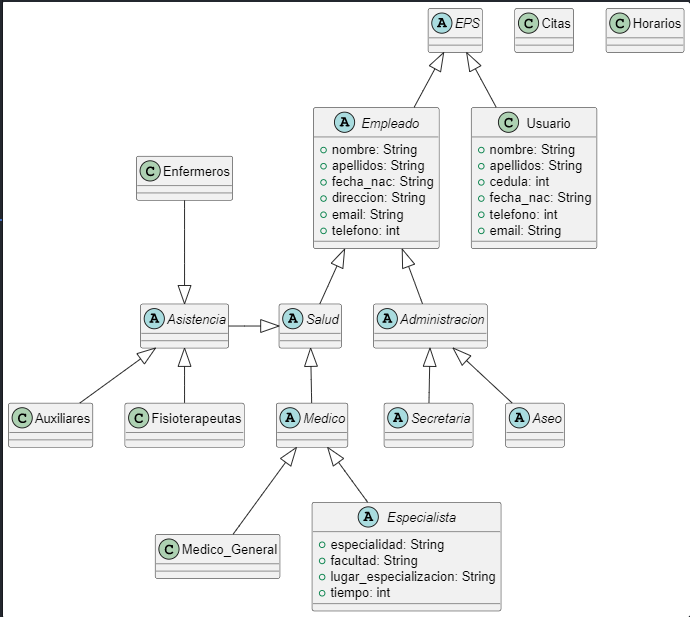

# PROYECTO INTEGRADOR

En la actualidad, la Clinica de Occidente cuenta con un problema en su sistema de gestion de la información, debido a esto, hay una gran congestion con sus pacientes por el mal desarrollo de su base de datos, el tiempo de espera puede llegar a ser muy amplio, no hay un buen control de citas y pueden llegar a perderse, esto es un problema en este ambito, ya que la salud es muy importante para todas las personas, debido a esto, pensamos crear un sistema bien optimizado para la correcta gestion de la información y así darle una solución al problema que tienen trabajadores y pacientes de esta clinica. 

## SOLUCIÓN: 

Para la solución de este problema, generaremos un sistema el cual permit la correcta gestion de la informacion de los usuarios y los empleados.

## JUSTIFICACIÓN:

La idea de este sistema es tener un registro más organizado, mejor orden y más práctico a la hora de hacer el registro. 

### ¿CÓMO LO HAREMOS?

- Construiremos un modulo el cual permitira ingresar los datos de los usuarios.
- Desarrollaremos una herramienta que organice cada dato ingresado.
- Crearemos un programa en el cual gestionaremos las citas e información general del usuario. 

